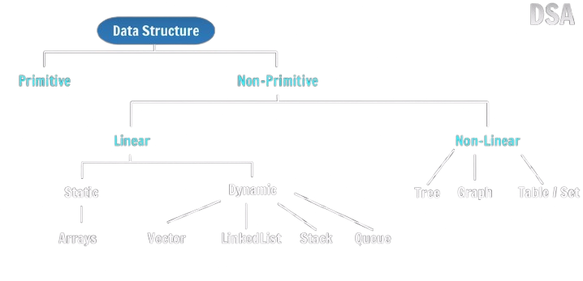

Flowchart & Pseudocode

Why study DSA?
Most of tech companies ask DSA question in thier coding rounds 
Software Engineering 

Why Companies ask DSA Questions?
They ask DSA questions because the better your DSA concepts are the better the problem solver you will be as a software engineer 

After going to a company major focus (Primary work) is on solving a problem 
Efficient and Optimally Solving a problem 

Algorithms and approaches -> DP , Greedy Algo , Two pointer Approach

The stronger the basic concepts of ours the easy will be to tackle big concepts
DSA concepts need to be learned with the a language -> Take a language (C++)

How to Solve a Problem 
Problem :- Find Sum of 2 numbers :a & b 

1.Understand
2.Input
3.Solution  sum:-a+b
4.Code

Flowchart & Pseudocode
Flowchart  is a diagram of a solution 
Pseudocode (General logic of solution)

practise problems(Write Flowchart & Pseudocode)
1.Area of Square
2.Min of 2 numbers
3.Is number even or odd 
4.Sum of numbers from 1 to N
5.Is number Prime or not

HomeWork
1.Calculate "Simple Interest" from Principal(P),Rate(R) & Time(T).(SI=(PxRxT)/100)
2.Calculate Max of 2 numbers.
3.Calculate Factorial of a number N.(n!=1x2x3x4x5...n)
4.Given a person's age, Find if they should get a driving license or not.
(age>=18) -> yes/no 